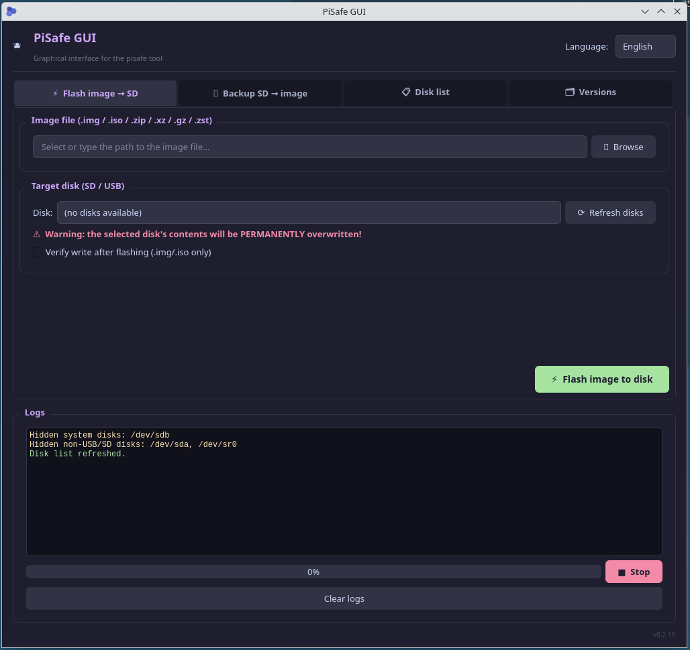

# PiSafe GUI 🫐

Graficzny interfejs (PyQt5) dla narzędzia [pisafe](https://github.com/RichardMidnight/pi-safe) — prosty sposób na flashowanie obrazów systemowych na karty SD/USB oraz tworzenie ich kopii zapasowych, bez używania terminala.


---

## 📸 Podgląd



---

## ✨ Funkcje

- **⚡ Flash obrazu → SD/USB** — wybierz plik obrazu (`.img`, `.zip`, `.xz`, `.gz`, `.zst`) i dysk docelowy, jednym kliknięciem
- **💾 Backup SD/USB → obraz** — twórz kopie zapasowe kart SD z wyborem formatu kompresji
- **🛡️ Ochrona dysków systemowych** — aplikacja automatycznie wykrywa i **ukrywa** dyski, na których zamontowany jest system (`/`, `/boot`, `/home` itd.), więc nie ma ryzyka przypadkowego nadpisania własnego systemu
- **📋 Lista dysków** — pełny podgląd podłączonych urządzeń blokowych (`lsblk`)
- **📜 Logi w czasie rzeczywistym** — pełny output komend widoczny w aplikacji
- **🎨 Ciemny motyw** — interfejs w stylu Catppuccin Mocha

---

## 🖥️ Wymagania

- Linux / Raspberry Pi OS
- Python 3.7+
- [PyQt5](https://pypi.org/project/PyQt5/)
- [pisafe](https://github.com/RichardMidnight/pi-safe) (narzędzie bazowe, instalowane automatycznie przez `install.sh`)

---

## 🚀 Instalacja

```bash
git clone https://github.com/cyryllo/pisafe-gui.git
cd pisafe-gui
bash install.sh
```

Skrypt `install.sh`:
1. Instaluje `python3-pyqt5` i `pv`
2. Instaluje narzędzie `pisafe`, jeśli nie jest jeszcze obecne w systemie
3. Tworzy skrót aplikacji w menu systemowym

---

## ▶️ Uruchomienie

Z menu systemowego System>PiSafe GUI

Z konsoli

```bash
python3 pisafe_gui.py
```

> Operacje flash/backup wymagają uprawnień `sudo`, ponieważ `pisafe` operuje bezpośrednio na urządzeniach blokowych. Aplikacja poprosi o hasło w trakcie wykonywania komendy.

---

## 📁 Struktura projektu

```
pisafe-gui/
├── pisafe_gui.py          # Główna aplikacja PyQt5
├── requirements.txt       # Zależności Pythona
├── install.sh             # Skrypt instalacyjny
└── README.md
```

---

## ⚠️ Znane ograniczenia

- Pasek postępu nie pokazuje rzeczywistego procentu w czasie rzeczywistym — zależy to od tego, czy `pisafe`/`dd` wypisuje dane progresu w stdout. Obecnie pasek skacze z 0% na 100% po zakończeniu operacji.

---

## 🗺️ Planowane funkcje (TODO)

- [ ] Rzeczywisty pasek postępu (np. przez `pv` lub monitorowanie rozmiaru pliku)
- [ ] Weryfikacja sumy kontrolnej obrazu (MD5/SHA256)
- [ ] Historia ostatnich operacji
- [ ] Powiadomienie systemowe po zakończeniu zadania
- [ ] Obsługa wielu dysków jednocześnie

---

## 🤝 Wsparcie i wkład

Pull requesty i zgłoszenia (issues) są mile widziane! Jeśli znajdziesz błąd lub masz propozycję funkcji, otwórz issue w tym repozytorium.

---

## 📄 Licencja

Ten projekt jest dostępny na licencji [MIT](LICENSE).

Bazuje na narzędziu [pisafe](https://github.com/RichardMidnight/pi-safe) autorstwa RichardMidnight.

---

## 🙏 Podziękowania

- [RichardMidnight](https://github.com/RichardMidnight) — za stworzenie narzędzia `pisafe`
- [Catppuccin](https://github.com/catppuccin/catppuccin) — za paletę kolorów motywu
